# WordCamp Ottawa 2014

Joey Kudish
Partnership Engineer at Automattic
[jkudish.com](http://jkudish.com)
@jkudish

<br><br> Let's talk about interacting with WordPress from outside of WordPress.

---

# Oh by the way, these slides are at http://slides.jkudish.com/

---

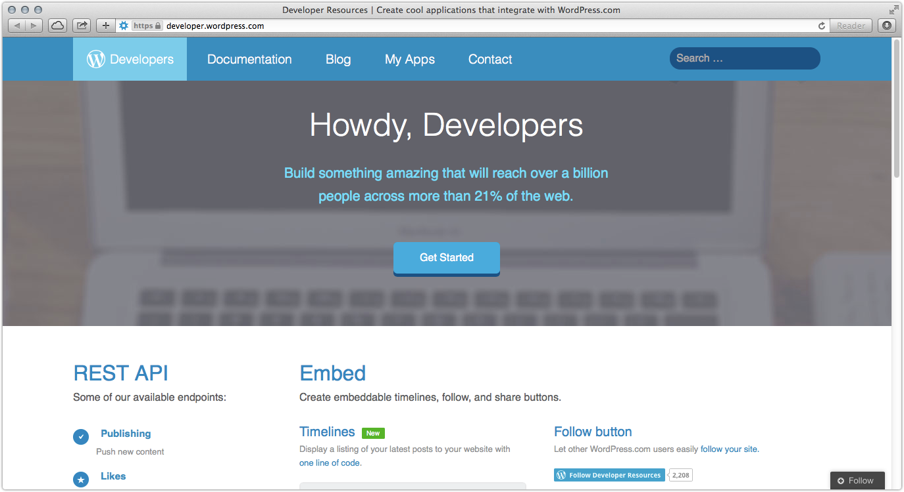

---

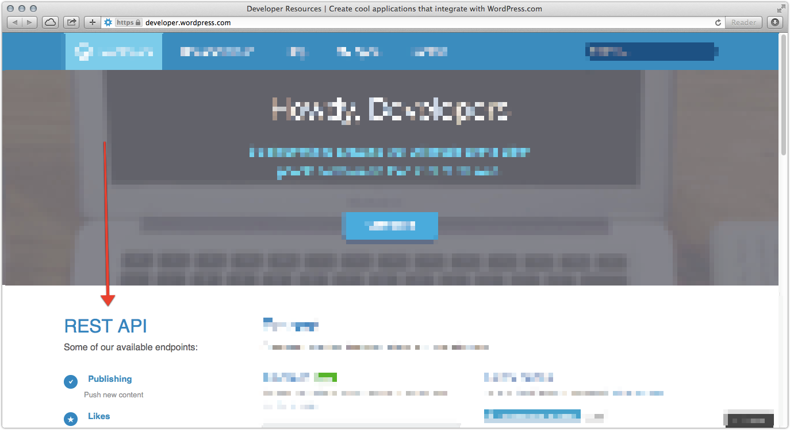

---

# What is the API exactly?

* json [RESTful API](https://stackoverflow.com/questions/671118/what-exactly-is-restful-programming)
* allows you to integrate data + features from WordPress into any application.
* works with any language/platform as long as it can make HTTP requests.
* works with WordPress.com and Jetpack-enabled WP.org blogs (since 1.9+! now at 2.9.3).

---

# What is the API exactly?

* uses oauth2 for authentication.
* some information queryable without authentication.
* insights/stats into your own app usage.


---

# What can you do with the API?

* user info
* site metadata
* create, edit, delete, find, reblog, and view posts (includes CPTs & post meta)
* create, edit, delete, find, and view comments
* search & related posts
* taxonomies (categories/tags & custom ones too)
 
---

# What can you do with the API?

* media
* likes & following/subscribing to a blog
* WordPress.com Freshly Pressed content
* notifications
* stats
* [WordPress.com reader](http://wordpress.com/read/)
* your own app's insights

---

# Who's using it?

---

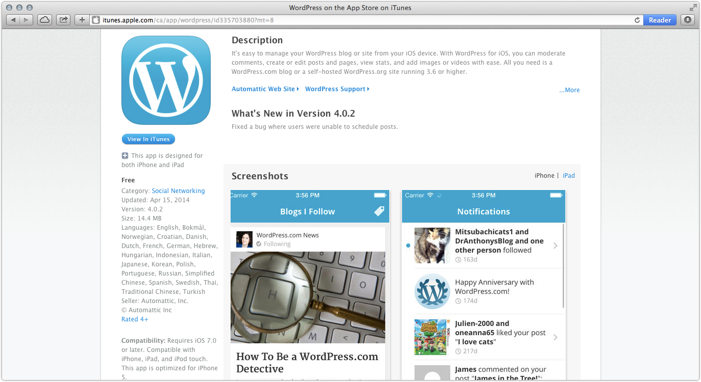

---

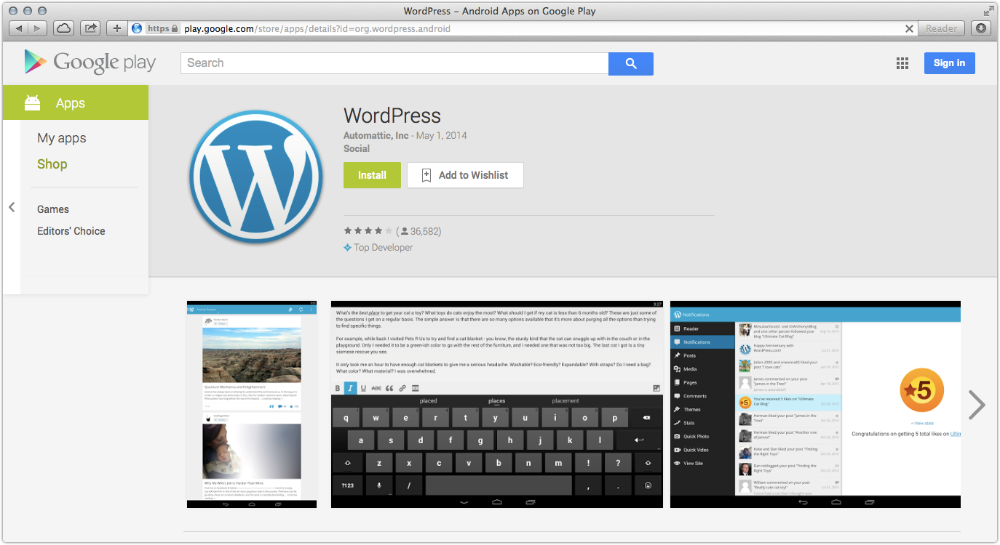

---

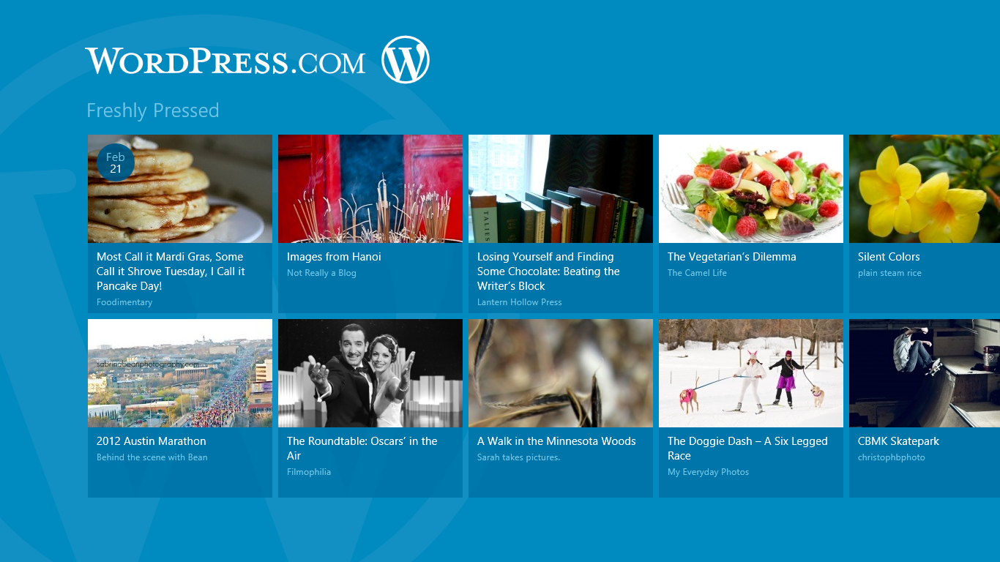

---

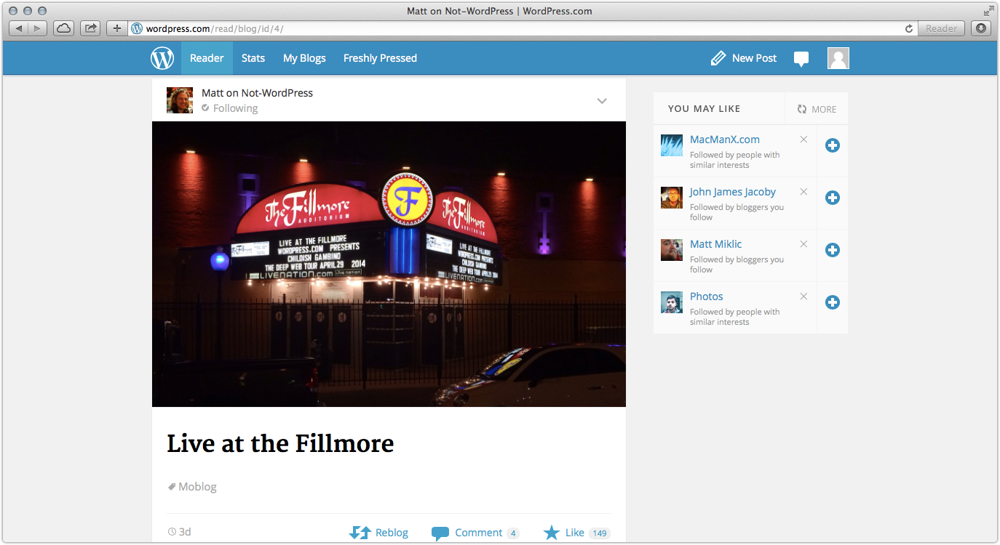

---

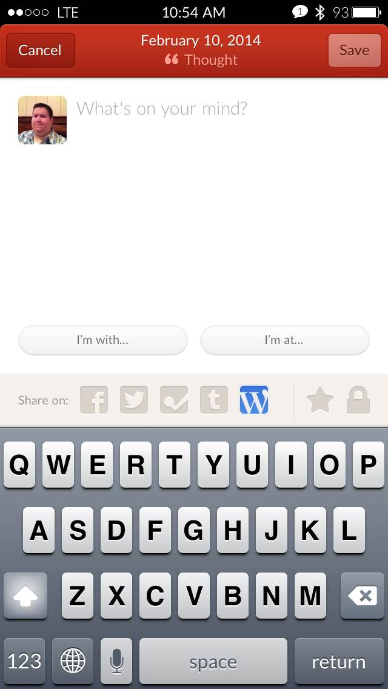

---

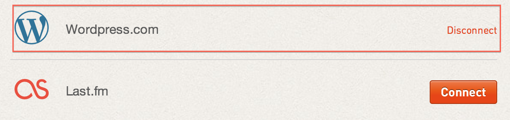

---

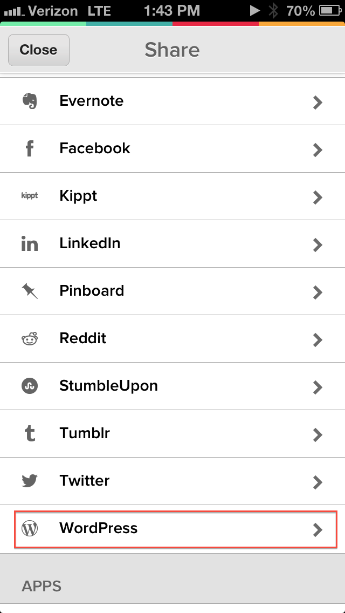

---

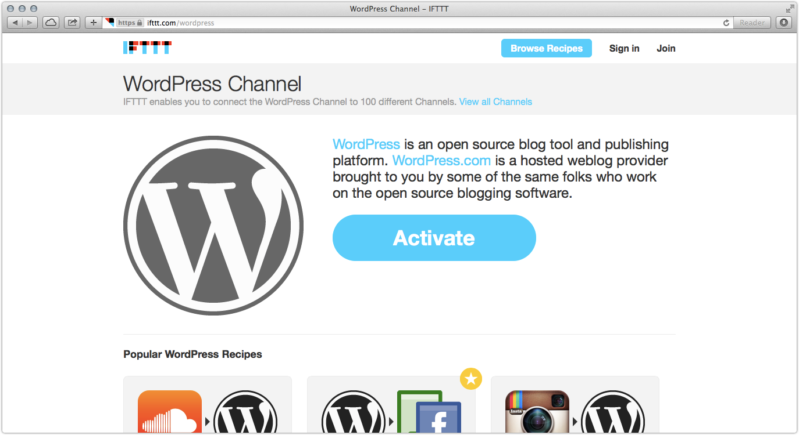

---

# Let's get started

---


---

### DEVELOPER.WORDPRESS.COM/APPS/

---

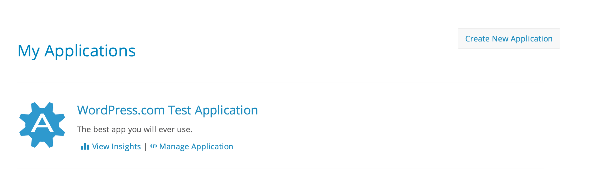

---

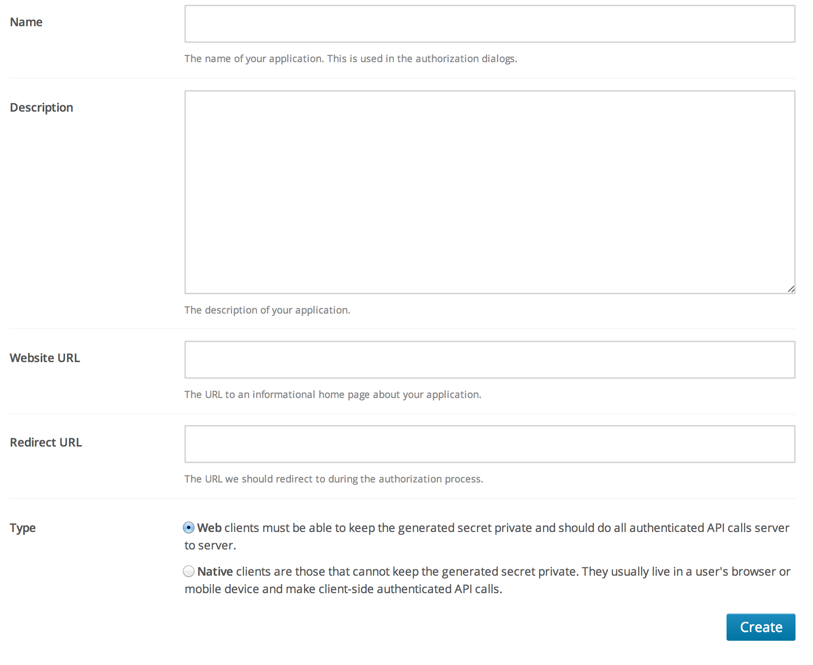

---

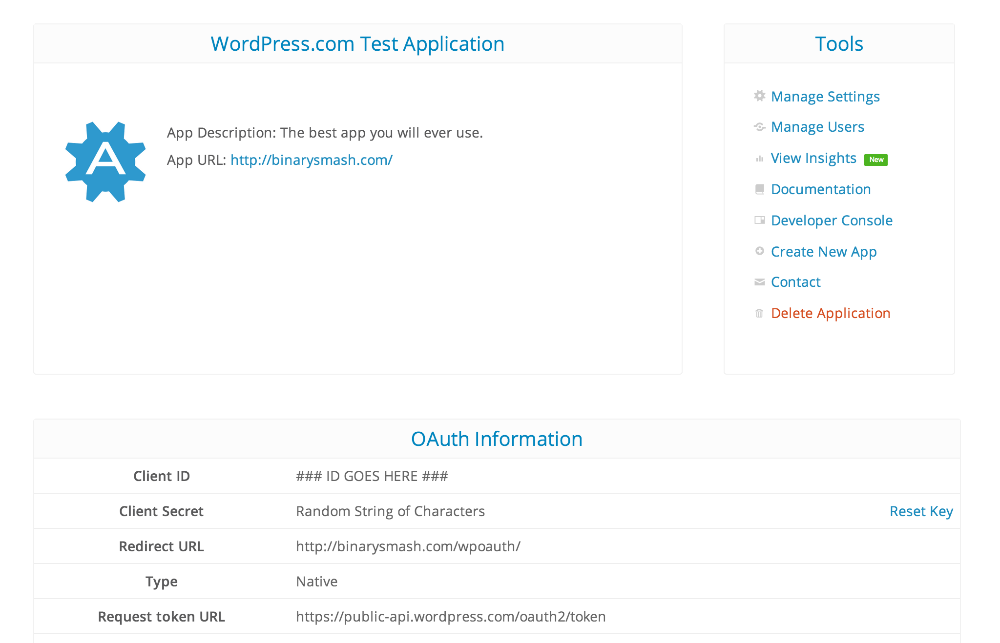

---

## Save them for later

```php
$client_id = '1'; 
$client_secret = '##############';
$redirect_url = 'http://wordcampottawaisthebest.com';
```

---
## AUTHENTICATION

* done via OAuth2
* authorization_code grant type

---

### DEVELOPER.WORDPRESS.COM/DOCS/OAUTH2/

---

## OAUTH2 ENDPOINTS

* https://public-api.wordpress.com/oauth2/authorize
* https://public-api.wordpress.com/oauth2/token

---

## FIRST STEP: REDIRECT

* https://public-api.wordpress.com/oauth2/authorize?client\_id=**your\_client\_id**&redirect\_uri=**your\_url**&response\_type=code
* Exchange it for access

---

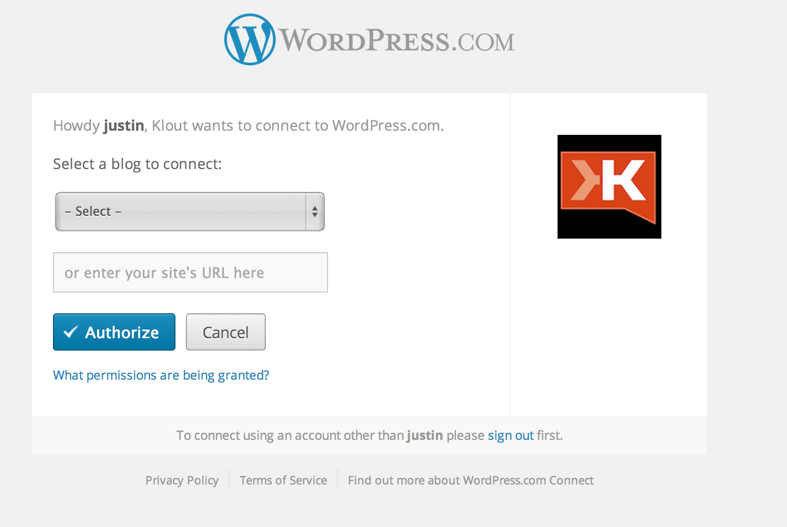

---

## In return, you get a code!!

### http://wordcampottawa.com/myapp/?code=**cw9hk1xG9k**

---

## Let's send that back to get access

```php
$curl = curl_init( "https://public-api.wordpress.com/oauth2/token" );
curl_setopt( $curl, CURLOPT_POST, true );
curl_setopt( $curl, CURLOPT_POSTFIELDSS, array(
	'client_id' => $client_id,
	'redirect_uri' => $redirect_uri,
	'client_secret' => sanitize_key( $_GET['code'] ), // the code we got from the authorization screen
	'grant_type' => 'authorization_code',
) );

curl_setopt( $curl, CURLOPT_RETURNTRANSFER, 1 );
$auth = curl_exec( $curl );
```

---

## You get some handy stuff back

```php
$secret = json_decode( $auth );
print_r( $secret );
```

```json
{
	'access_token' : **YOUR_API_TOKEN**
	'blog_id' : 1234
	'blog_url' : 'http://mysupercooljetpackblog.com'
	'token_type' : 'bearer', 
}
```

---

## Save the token and site ID for later.

```php
$access_token = $secret->access_token;
$site_id = $secret->blog_id;
```

_Huzzah! authentication is as simple as that..._

---

## What good is any of this so far?

### Let's make our first _real_ API call.

---

### WHO AM I?? 
## `https://public-api.wordpress.com/rest/v1/me`

---

```php
$options = array(
	'http' =>
	array(
		'ignore_errors' => true,
		'header' => array(
			'authorization: Bearer ' . **$access_token**,
		),
	),
);

$context = stream_context_create( $options );
$response = file_get_contents( 'https://public-api.wordpress.com/rest/v1/me', false, $context );

$reponse = json_decode( $response );
```

---

`GET https://public-api.wordpress.com/rest/v1/me`

```json
{
	"ID": 10916751,
	"display_name": "Joey Kudish",
	"username": "jkudish",
	"email": "jkudish@automattic.com",
	"primary_blog": 21221610,
	"token_site_id": false,
	"avatar_URL": "https://2.gravatar.com/avatar/e3b86944dc95b3f722798bc3a74fe11d?s=96&d=identicon",
	"profile_URL": "http://en.gravatar.com/jkudish",
	"verified": true,
	"meta": {
		"links": {
			"self": "https://public-api.wordpress.com/rest/v1/me",
			"help": "https://public-api.wordpress.com/rest/v1/me/help",
			"site": "https://public-api.wordpress.com/rest/v1/sites/5836086"
		}
	}
}
```

---

## What theme am I running on my primary blog?

`GET https://public-api.wordpress.com/rest/v1/sites/21221610/themes/mine`
(We got the site ID from the `primary_blog` key from the last response.)

___

```json
{
	"id": "writr",
	"screenshot": "https://i2.wp.com/s0.wp.com/wp-content/themes/pub/writr/screenshot.png",
	"cost": {
		"currency": "USD",
		"number": 0,
		"display": ""
	},
	"version": "1.0.8",
	"download_url": "https://public-api.wordpress.com/rest/v1/themes/download/writr.zip",
	"trending_rank": 62,
	"popularity_rank": 66,
	"launch_date": "2013-10-31",
	"name": "Writr",
	"description": "Writr is a minimalist...",
	"tags": [ ... ]
}
```

---

## Let's change it!

`POST https://public-api.wordpress.com/rest/v1/sites/21221610/themes/mine`

`curl 'https://public-api.wordpress.com/rest/v1/sites/36336212/themes/mine?http_envelope=1&' --data 'theme=twentythirteen'`

_(auth removed for brevity)_

---

```json
{
	"id": "twentythirteen",
	"screenshot": "https://i1.wp.com/s0.wp.com/wp-content/themes/pub/twentythirteen/screenshot.png",
	"cost": {
		"currency": "USD",
		"number": 0,
		"display": ""
	},
	"version": "1.2",
	"download_url": "",
	"trending_rank": 54,
	"popularity_rank": 7,
	"launch_date": "2013-04-24",
	"name": "Twenty Thirteen",
	"description": "The 2013 theme ...",
	"tags": [ ... ]
}
```

---

### Jetpack just works

* you don't need to do anything special, just activate the `JSON API` module (auto-activated by default),
* Jetpack sites show up in the OAuth Dialog.
* Jetpack sites have a site ID just like WordPress.com.
* a few endpoints (e.g. reblogging) are WordPress.com only.
* the `/me` endpoint always returns the WordPress.com user.

---


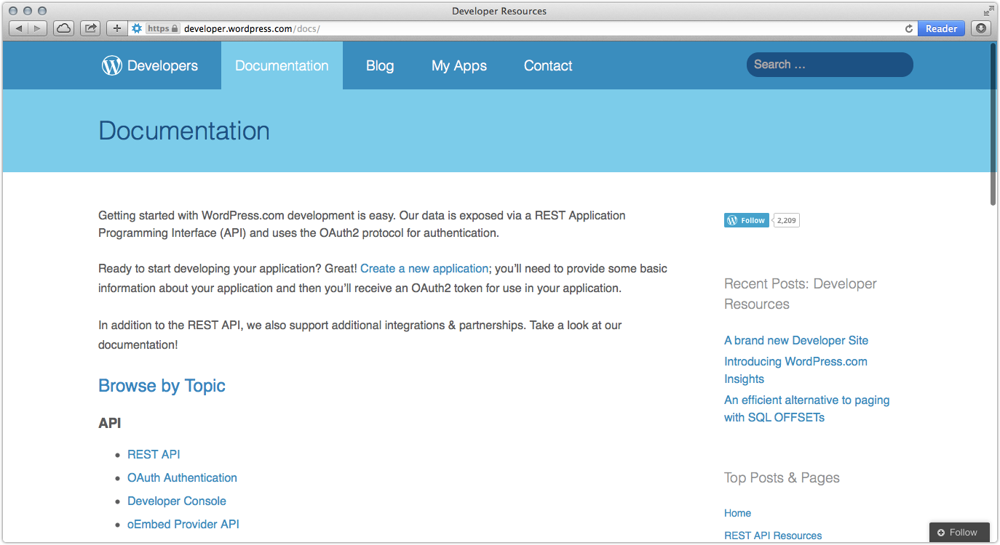

---

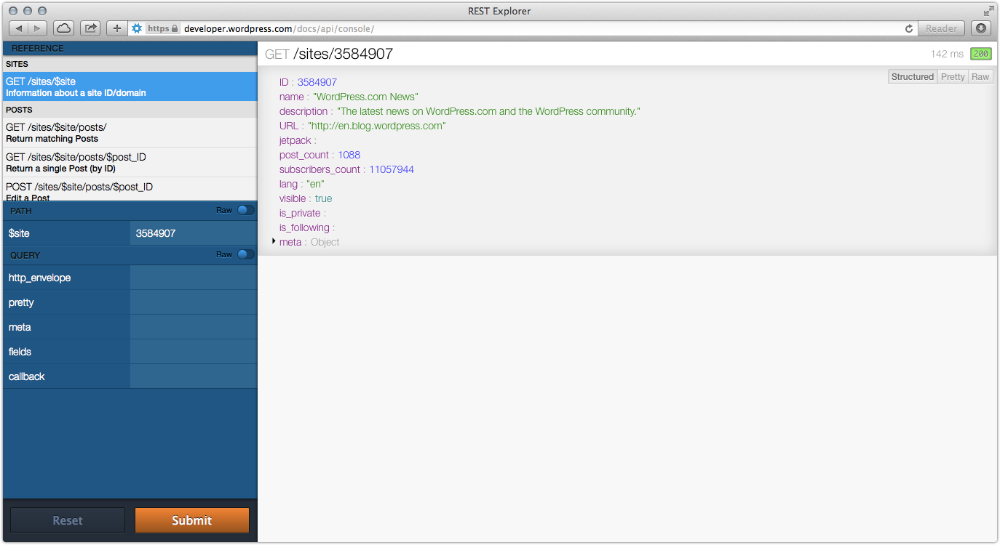

---

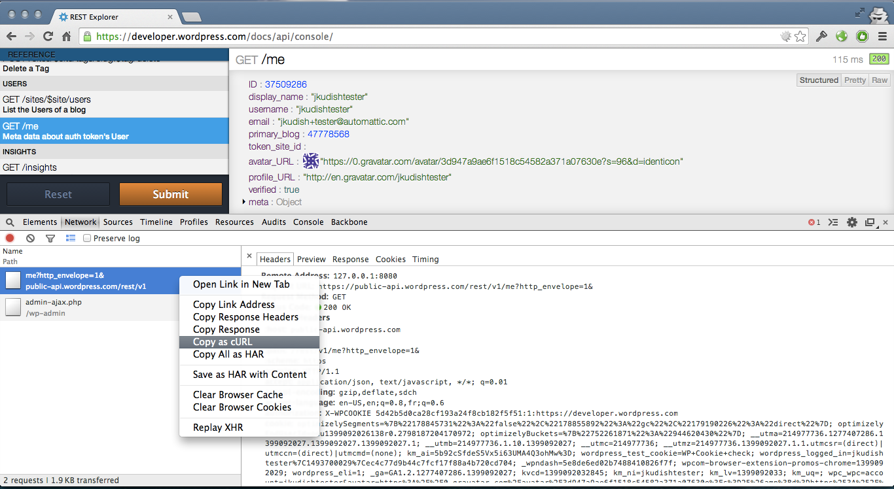

---

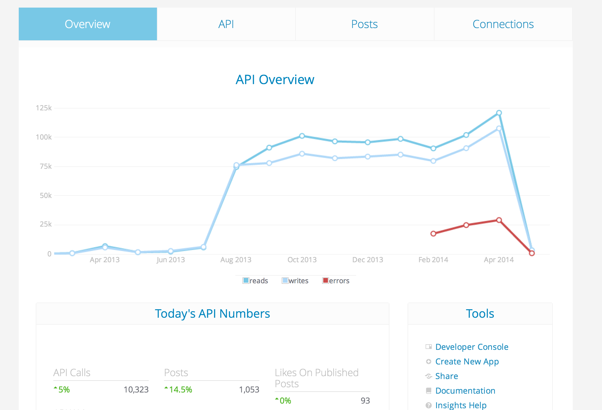

---

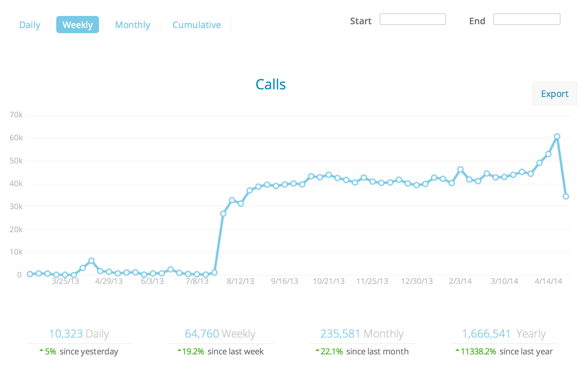


---

## Custom Post Types & metadata

* If you're a WordPress.com VIP client or use Jetpack, you can easily support CPTs and custom metadata in the REST API
* http://wp.me/p2gHKz-OY
* There's 2 filters `rest_api_allowed_post_types` and  `rest_api_allowed_public_metadata`

---

# Don't want to query blogs? Just need auth?

Try WPCC


---

# Want a follow button?

### http://developer.wordpress.com/docs/follow-button-creation/

---

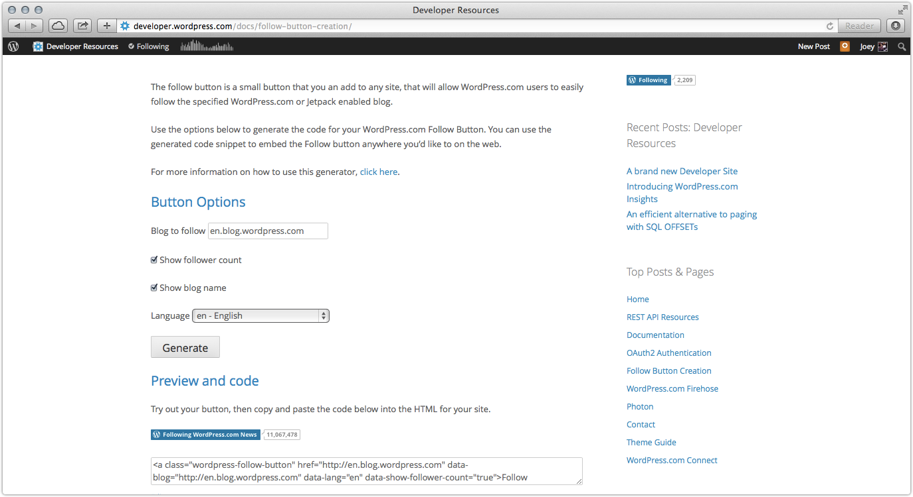


---

# Want an embeddable timeline

### http://developer.wordpress.com/docs/embedded-timelines/

---

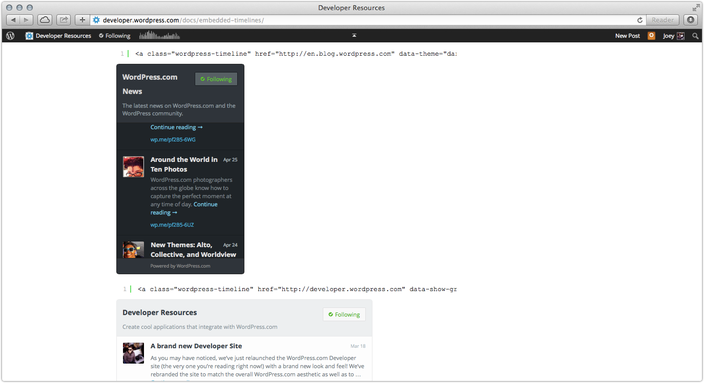

---

# I'm lost, what are my resources?

* All the docs are at [developer.wordpress.com/docs](http://developer.wordpress.com/docs/).
* Other resources at [developer.wordpress.com](http://developer.wordpress.com/).
* Tweet us [@AutomatticEng](http://twitter.com/AutomatticEng).
* Contact form (we reply within a day usually) [developer.wordpress.com/contact](http://developer.wordpress.com/contact).
* Email me directly: [jkudish@automattic.com](mailto:jkudish@automattic.com).


---

# What's next?

* support for publicize (automatic publishing to external services) in the API.
* bring all the endpoints up to par with wp-admin. Everything you can do in wp-admin should be do-able from the API.
* implicit oauth.
* more how-to's and sample apps on the developer site
* CORS support: so that you can build a full JS app without any server-side code or hacky iFrames.
* What do you want to see?

---

# Ask me Anything + Discussion

* REST API/Developer resources
* WordPress.com/Jetpack
* WordPress development at large
* Working remotely (and travelling while doing it!)
* Automattic
* Beagles
* Bonus (time permitting): let's create your first app
